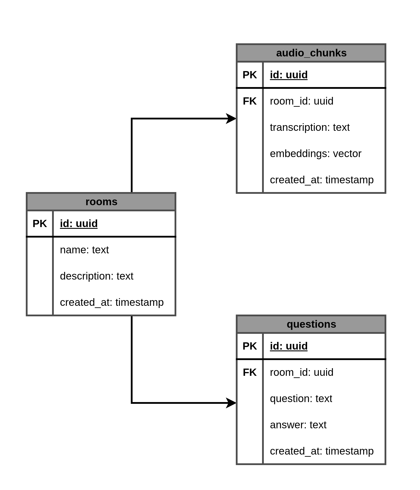

# Agents Server

O **Agents Server** permite criar salas para gravação de áudios e realizar perguntas que são respondidas por IA com base no conteúdo gravado.

O projeto web(frontend) pode ser encontrado **[aqui](https://github.com/MarcosWinicios/agents-web)**.

## Tecnologias e Bibliotecas Utilizadas

- **[NodeJS](https://nodejs.org/pt)** – Ambiente de execução JavaScript no servidor
- **[Fastify](https://www.fastify.io/)** – Framework Node.js rápido e de baixa sobrecarga.
  - **Fastify/cors e Fastify/multipart** – CORS e upload de arquivos via Fastify.
- **[TypeScript](https://www.typescriptlang.org/)** – Tipagem estática para maior segurança e clareza.
- **[Drizzle ORM](https://orm.drizzle.team/)** – ORM moderno e leve para PostgreSQL.
- **[Zod](https://zod.dev/)** – Validação e tipagem de dados.
- **[Google/genai](https://www.npmjs.com/package/@google/genai)** – Integração com Google Generative AI.
- **[Biome](https://biomejs.dev/pt-br/)** – Linter e formatter.
- **[PostgreSQL](https://www.postgresql.org/)** – Banco de dados relacional robusto e open source.

---

## Padrões e Organização

- **Fastify com TypeScript e Zod** para schemas de rotas e validações.
- **Drizzle ORM** para migrations, seeds e consultas tipadas.
- **Variáveis de ambiente** são gerenciadas em arquivos `.env`.
- **Scripts de banco de dados** para gerar, migrar e popular dados.
- **Pgvector** para realizar consultar por similaridade.
- **Gemini AI** para gerar respostas com base na transcrição de áudio.

---

## Banco de dados



## Scripts disponíveis

- `npm run dev` – Executa o servidor em modo desenvolvimento.
- `npm start` – Executa o servidor em produção.
- `npm run db:generate` – Gera artefatos do Drizzle ORM.
- `npm run db:migrate` – Executa as migrations do banco de dados.
- `npm run db:seed` – Executa os seeds no banco de dados.

---

## Configuração e Execução

1️⃣ **Clone o repositório:**

```bash
  git clone git@github.com:MarcosWinicios/agents-server.git
```

2️⃣ **Instale as dependências:**

```bash
  npm install
```

3️⃣ **Configure as variáveis de ambiente:**
Copie o arquivo de exemplo:

```bash
  cp .env.example .env
```

Edite o arquivo .env conforme seu ambiente (credenciais do banco PostgreSQL, API Key da GenAI, etc).

4️⃣ **Configure o banco de dados:**

- Execute as migrations para criar as tabelas necessárias:

```bash
  npm run db:generate

  npm run db:migrate
```

- Opcional: Execute os seeds para popular o banco com dados iniciais:

```bash
  npm run db:seed
```

5️⃣ **Inicie o servidor em modo desenvolvimento:**

```bash
  npm run dev
```

O servidor estará disponível na porta configurada em seu .env.

## API Endpoints

### Health Check

`GET /health`  
Verifica se o servidor está online.

**Response:**

- `200 OK`

```json
{
  "status": "ok"
}
```

---

### Listar Salas

**GET** `/rooms`  
Retorna a lista de salas criadas.

**Response:**

- `200 OK`

```json
[
  {
    "id": "uuid",
    "name": "Nome da sala",
    "description": "Descrição da sala"
  }
]
```

---

### Criar Sala

**POST** `/rooms`  
Cria uma nova sala.

**Request Body:**

```json
{
  "name": "Sala de teste",
  "description": "Essa é uma sala de teste"
}
```

**Response:**

- `201 Created`

```json
{
  "roomId": "uuid"
}
```

---

### Listar Perguntas de uma Sala

**GET** `/rooms/{roomId}/questions`  
Retorna todas as perguntas vinculadas a uma sala específica.

**Params:**

- `roomId` – UUID da sala

**Response:**

- `200 OK`

```json
[
  {
    "id": "uuid",
    "question": "Conteúdo da pergunta"
  }
]
```

---

### Criar Pergunta em uma Sala

**POST** `/rooms/{roomId}/questions`  
Cria uma nova pergunta em uma sala específica.

**Params:**

- `roomId` – UUID da sala

**Request Body:**

```json
{
  "question": "O que é Vue.js e a sua diferença em relação ao Angular?"
}
```

**Response:**

- `201 Created`

```json
{
  "questionId": "uuid"
}
```

---

Projeto desenvolvido durante um evento da **Rocketseat**.
